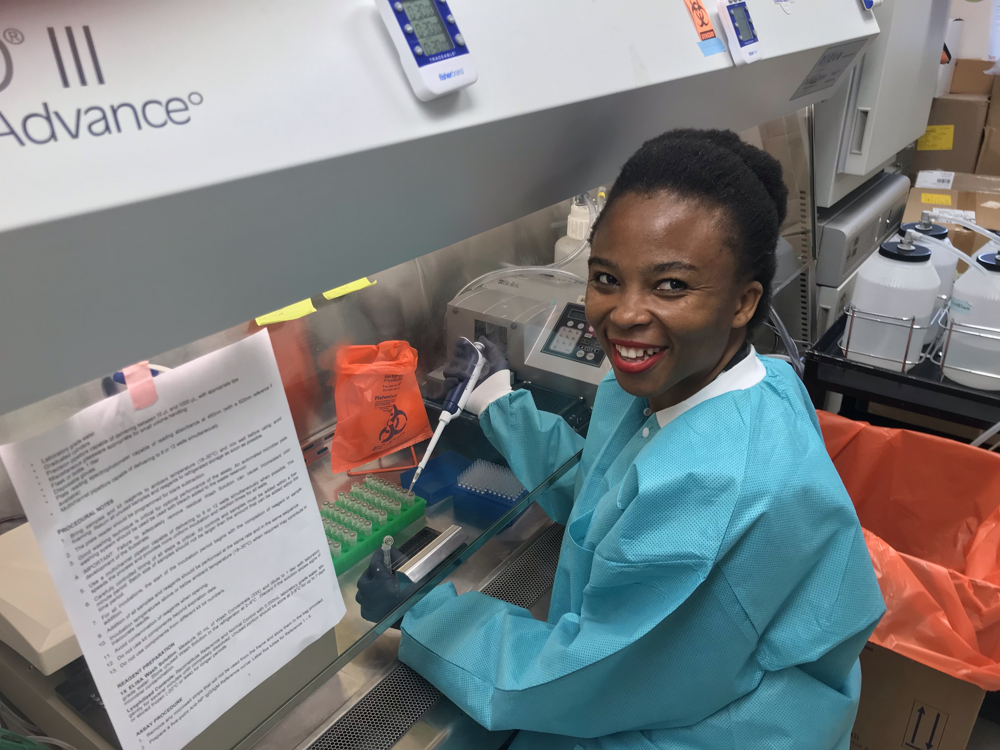
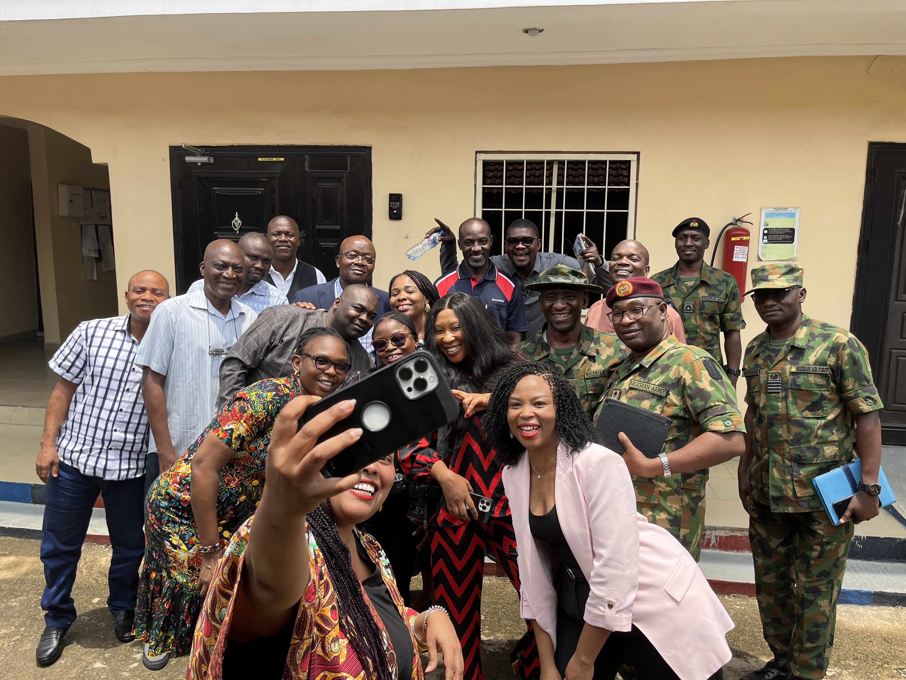
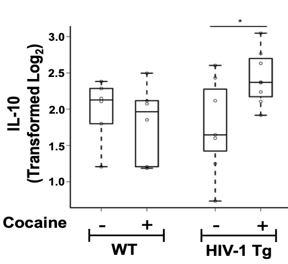
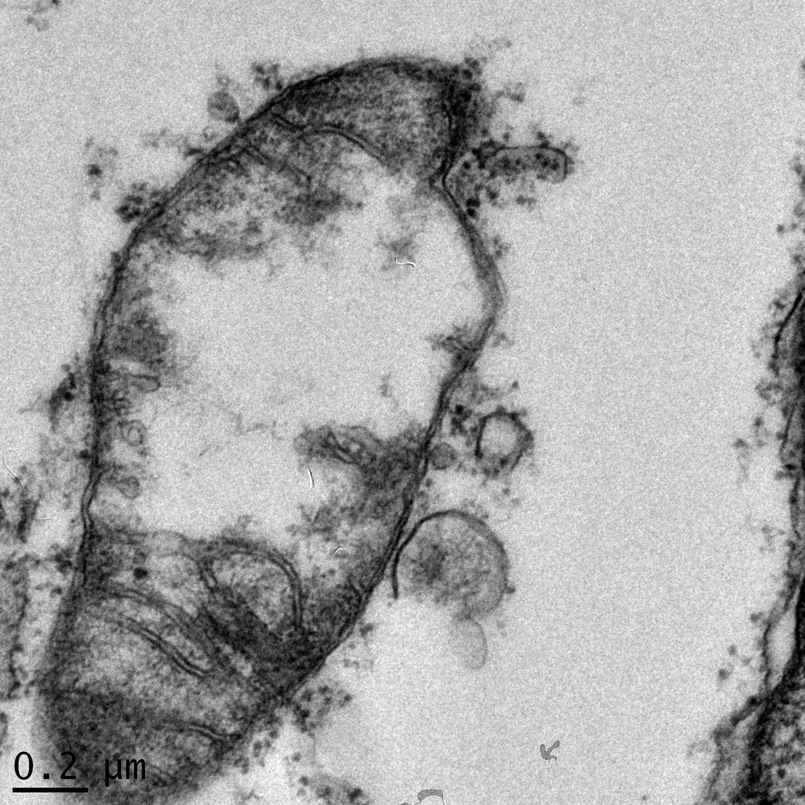

::: {.about-hero}
::: {.about-card}
{.about-card-photo}

## Chiomah Ezeomah

### Immunologist, Biostatistician & Infectious Diseases Scientist

::: {.about-icons}

  <a href="https://www.linkedin.com/in/chiomahezeomah/" aria-label="LinkedIn">
    <i class="bi bi-linkedin"></i>
  </a>
  <a href="https://github.com/ChiomahEzeomah" aria-label="GitHub">
    <i class="bi bi-github"></i>
  </a>
  <a href="https://www.youtube.com/@LearnwithChiomah" aria-label="YouTube">
    <i class="bi bi-youtube"></i>
  </a>
  <a href="mailto:chiomah.ezeomah@gmail.com" aria-label="Email">
    <i class="bi bi-envelope-fill"></i>
  </a>

:::
:::

::: {.about-intro}
## Hey, I’m happy you’re here

Thanks for stopping by.

I am an immunologist and biostatistician / data scientist with training from Cornell University and the University of Oxford. My work sits at the intersection of immunology, infectious diseases research, vaccine development, public health implementation, and scientific communication.

I am especially interested in using science, data, and education to strengthen infectious diseases response systems and to make complex biomedical ideas easier to understand.

You can learn more about my research in [Research](research.qmd), explore my scientific implementation work in [Consulting](consulting.qmd), and follow my paper breakdowns and tutorials in [Blog](blog.qmd).
:::
:::

## About me {.about-page-heading}

::: {.about-columns}
::: {.about-col}
### Background

I hold a Master of Science degree in Biostatistics and Data Science from [Cornell University]((https://phs.weill.cornell.edu/graduate-education-clinical-training/masters-track/biostatistics-data-science)) and a Master of Science degree in Integrated Immunology from the [University of Oxford](https://www.ox.ac.uk/admissions/graduate/courses/msc-integrated-immunology).

Prior to my master’s training, I graduated magna cum laude with a Bachelor of Science degree in Biological Sciences with honors and a Bachelor of Arts degree in Mathematics-Economics with honors and distinction from the University at Buffalo.

I have extensive experience in virology research, biostatistics, infectious diseases implementation, vaccine development, scientific consulting, and biosafety capacity building through work connected to the Galveston National Laboratory, Cornell University, the University of Oxford, the Oxford Vaccine Group and Biosafety Management Company.
:::

::: {.about-col}
### Consulting Work

I founded Biosafety Management Company, a social enterprise through which we provide consulting services to strengthen infectious diseases response systems.

Our work has included laboratory design and setup, biosafety training, and support for public health laboratory capacity. This implementation work reflects my broader scientific mission: connecting research, laboratory systems, biosafety, and public health practice.

### Interests

- Immunology
- Infectious diseases research
- Vaccine development
- Biostatistics and data science
- Scientific communication
- R programming education

::: {.about-meta}
Scientist • Educator • Consultant
:::
:::
:::

## Research | Consulting | Teaching {.about-page-heading}

::: {.about-grid}
::: {.about-grid-item}
### Research

{.about-grid-image}

My academic and translational research in virology, immunology, vaccines, and public health.

[Explore Research](research.qmd)
:::

::: {.about-grid-item}
### Consulting

{.about-grid-image}

Scientific consulting and capacity building in biosafety, laboratory systems, and infectious diseases response.

[Explore Consulting](consulting.qmd)
:::

::: {.about-grid-item}
### Blog

{.about-grid-image}

Journal Club with Chiomah: paper breakdowns, methods explanations, and R-based tutorials.

[Go to Blog](blog.qmd)
:::

::: {.about-grid-item}
### Publications

{.about-grid-image}

Selected publications and scholarly work across virology, immunology, and public health.

[View Publications](publications.qmd)
:::
:::