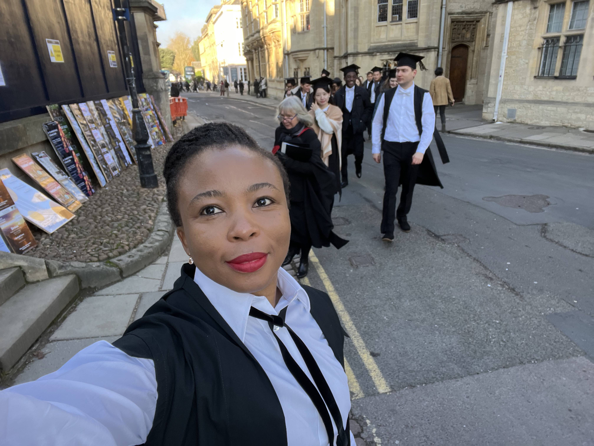

::: {.columns}
::: {.column width="62%"}
## Immunologist, Biostatistician, and Infectious Diseases Scientist

I am an immunologist and biostatistician / data scientist with a strong interest in biomedical and translational research. My work is broadly centered on vaccine development across infectious diseases and other major areas of human health, with a particular focus on the immunologic mechanisms required to generate robust, durable, and protective immune responses.

My specific scientific interests lie in T-cell and B-cell immunology, especially in understanding how vaccines and immunologic interventions can be designed to elicit strong effector responses, establish durable immune memory, and support long-term protection against disease relapse, recurrence, or reinfection. I am especially interested in the cellular and molecular determinants of immune priming, memory formation, and immune durability, and in how these principles can be applied to the rational design and evaluation of next-generation vaccines.

I hold a master's degree in Biostatistics and Data Science from [Cornell University](https://gradschool.weill.cornell.edu/biostatistics-and-data-science), and a second master's degree in Integrated Immunology from the [University of Oxford](https://www.nds.ox.ac.uk).
.

My work spans immunology, vaccine research, scientific consulting, biosafety, laboratory systems strengthening, public health implementation, and R-based teaching.

[About](about.qmd){.btn .btn-outline-primary}
[Research](research.qmd){.btn .btn-outline-primary}
[Blog](blog.qmd){.btn .btn-outline-primary}
:::

::: {.column width="38%"}
{width="100%"}
:::
:::