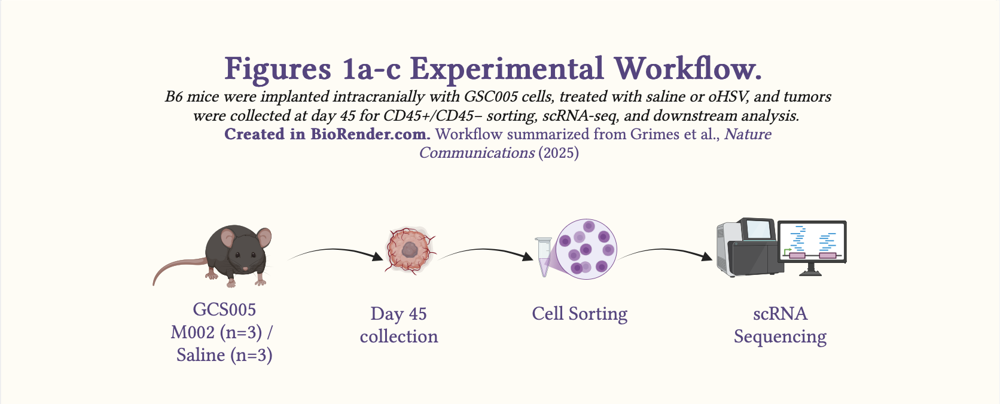
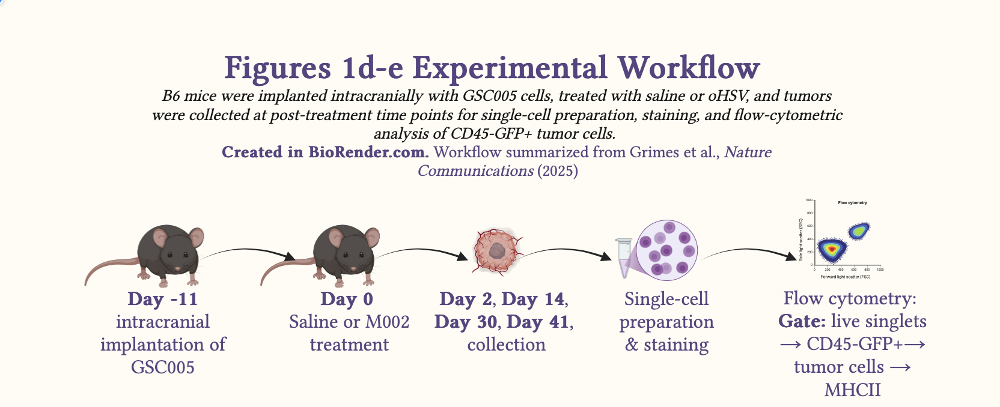

## Citation

Grimes JM, Ghosh S, Manzoor S, Li LX, Moran MM, Clements JC, Alexander SD, Markert JM, Leavenworth JW. **Oncolytic reprogramming of tumor microenvironment shapes CD4⁺ T-cell memory via the IL6ra-Bcl6 axis for targeted control of glioblastoma.** Nature Communications. 2025;16:1095. Open access.

## Why this paper matters

Glioblastoma multiforme (GBM) is the most common form of glioma, a type of primary brain cancer which has an incidence of about 25,000 new cases per year in the US adult population. Clinical management of GBM is faced with challenges including:

1.  Getting therapeutics to cross the blood-brain barrier and reach tumor cells.

2.  the 'cold' state of the tumor microenvironment which causes immunosuppression that is characteristic of GBM, this cold state is a notable immune evasion mechanism in GBM.

3.  With the standard of care, GBM has a high rate of recurrence with aggressive regrowth.

In this study, Grimes et al. used an oncolytic herpes simplex virus (oHSV) expressing murine IL12 (M002) to show that in murine models of GBM (GSC005), M002 alters the tumor microenvironment. Specifically, the results showed that mice treated with M002 had fewer tumor cells and microglia and more T cells in the tumor microenvironment.

Clinically, these results suggest that oHSV has the potential to induce tumor cell killing and shift the immune state from immunosuppressive 'cold' to immunostimulatory 'hot' by increasing the T cell infiltration into the TME and increasing the MHC class II (MHCII) expression on intratumoral cells including residual tumor cells. Increased MHCII expression, including on residual tumor cells may facilitate engagement with T cells and help suppress long-term recurrence.

While this study was in murine models, it holds promise for clinical management of GBM in humans and can potentially improve the outcomes for patients with this form of cancer.

## Main scientific question

**Primary question:**

Can a neurotropic virus such as oHSV be engineered to alter the tumor microenvironment in glioblastoma multiforme and improve the therapeutic outcomes of patients with this form of cancer?

**Mechanistic question:**

By what mechanism does oHSV boost anti-tumor immune responses and how long does that immunity last?

## Analysis Part I: Part I of this analysis will focus on result 1 from the paper.

*Result 1:* Treatment with oncolytic herpes simplex virus expressing murine IL12 (M002) alters the immunophenotype of the GBM tumor microenvironment in syngeneic murine models (GSC005) and upregulates the expression of MHCII molecules on residual tumor cells.

## Study design for Fig. 1a-c

::: {style="text-align: center;"}


<p><em>Schematic 1: Experimental workflow summarizing the in vivo design for Fig. 1a–c.</em></p>
:::

### Fig. 1a-c:

**Study Design:** The authors used a controlled, cross-sectional in-vivo animal study to investigate changes to the tumor microenvironment following oHSV treatment using single-cell RNA-seq.

**Syngeneic murine model:** GSC005, a syngeneic murine GBM model in C57BL/6 (B6) mice.

**Time point:** day 45

**N:** M002 (n=3); saline (n=3)

**Method:** Single-cell RNA transcriptomics

**Note:** Although 15,241 cells were analyzed, the experimental unit is the mouse, not the cell.

## Study design for Fig. 1d-e

::: {style="text-align: center;"}


<p><em>Schematic 2: Experimental workflow summarizing the in vivo design for Fig. 1d-e.</em></p>
:::

### Fig. 1d-e:

**Study Design:** The authors utilized a factorial, independent-samples experimental in vivo study design to investigate the correlation between oHSV treatment and MHCII expression on tumor cells using flow cytometry.

**Syngeneic murine model:** GSC005, a syngeneic murine GBM model in C57BL/6 (B6) mice.

**Time point:** days 2, 14, 30, and 41 (the paper’s figure legend refers to day 4.5 rather than day 2; here I follow the main-text wording for consistency with the narrative)

**N:** day 2 \[M002 (n=5); saline (n=5)\]; day 14 \[M002 (n=6); saline (n=6)\]; day 30 \[M002 (n=5); saline (n=5)\] and day 41 \[M002 (n=6), saline (n=6)\]

*Note:* The paper contains a discrepancy between day 2 in the main text and day 4.5 in the figure legend. In this journal review, I follow the main-text day 2 wording for consistency, while acknowledging the discrepancy.

**Method:** Flow cytometry

## Methods explained

### Single-Cell RNA-seq

In summary, single cell RNA-seq (scRNA-seq) was used in this paper (Fig 1a, 1b & 1c) to analyze the cellular makeup of the tumor microenvironment and to characterize treatment-associated changes that might modulate immune responses to oHSV.

### Flow cytometry

Additionally, flow cytometry was used to measure the frequency of MHCII-positive tumor cells and the fluorescence intensity of MHCII expression in those cells.

## Key results

*Key definitions the authors used:*

1.  **T cells:** Cells with cd3e and cd3g \> 1

2.  **Myeloid cells:** All myeloid cells except dendritic cells (DCs)

3.  **Non-T CD45+ cells:** CD45⁺ cells except T, myeloid and microglia

4.  **Other CD45- cells:** CD45⁻ cells except tumor cells

Part I: Key findings from these assays include:

-   oHSV treatment restructured the immune phenotype of the GBM microenvironment by increasing T cells and decreasing tumor cells and microglia. It also significantly upregulated MHCII expression on residual tumor cells in oHSV-treated mice.

## Results Explained

Based on Fig. 1a-e:

1.  Overall, oHSV treatment restructured the immune phenotype of the GBM microenvironment by decreasing tumor cells and microglia and increasing T cells. Furthermore, it increased the expression of MHCII on residual tumor cells.

**Fig. 1a-b interpretation:** The authors analyzed 15,241 cells following scRNA-sequencing:

In Fig. 1a, UMAP dimensionality reduction was used to cluster the cells based on cell markers. The UMAP analysis showed distinct cell populations including tumor cells, T cells, non-T CD45⁺ cells, other CD45⁻ cells, myeloid cells and microglia present in the TME of both M002- and saline-treated mice.

In Fig. 1b, compared to saline-treated mice, the relative proportion of T cells and non-T CD45⁺ cells increased, while the relative proportion of tumor cells and microglia decreased in M002-treated mice, demonstrating an altered immune profile following oHSV treatment. Together, these changes are consistent with a restructuring of the TME from a colder to a more inflamed state, marked by increased T-cell infiltration and evidence of tumor-cell killing following oHSV treatment.

**Fig. 1c interpretation:** The authors then examined MHCII-related gene expression across the 15,241-cell dataset in greater detail.

In Fig. 1c, overall, visual inspection suggests that M002 increased the expression of MHCII-related genes across several intratumoral cell populations. Specifically, we observe an M002-dependent increase in classical MHCII genes: H2-Ab1; H2-Aa, H2-Eb1 and in the non-classical MHCII gene: H2-DMb1 in non-T CD45⁺ cells. In microglial cells, we observe an M002-dependent increase in the expression of non-classical MHCII genes: H2-DMa; H2-DMb1 & H2-Oa. While in myeloid cells, we observe an M002-driven increase in classical MHCII genes: H2-Ab1, H2-Aa & H2-Ea. Notably, in tumor cells, an increase in M002-treated mice compared with controls is seen in the classical MHCII gene H2-Ab1.

**Fig 1d-e interpretation:**

*Note:* This interpretation is based on the two-way ANOVA performed here for teaching purposes, not on the unpaired Student’s t test reported by the authors in the paper.

*Frequency vs time:* Two-way ANOVA revealed no significant main effect of treatment on frequency of expression of MHCII, F(1,36) = 3.27, p = 0.0788, no significant main effect of day on expression of MHCII, F(3,36) = 1.10, p = 0.3636, and no significant treatment-by-day interaction, F(3,36) = 1.66, p = 0.1923.

*MFI vs time:* Two-way ANOVA on log-transformed MFI revealed a significant main effect of treatment, F(1,36) = 6.35, p = 0.0163, and a significant main effect of day, F(3,36) = 10.44, p = 4.38 × 10\^-5, with no significant treatment × day interaction, F(3,36) = 0.824, p = 0.489. Residuals did not significantly deviate from normality after transformation (Shapiro–Wilk W = 0.964, p = 0.186), and Levene’s test showed no significant heterogeneity of variance (F(7,36) = 2.13, p = 0.065).

Although frequency showed no significant main effects or interaction, the log-transformed MFI showed significant main effects of treatment and day, indicating that the detectable signal was stronger for expression intensity than for the proportion of positive cells. This is likely reflective of a larger biological effect on per-cell expression.

## Statistics explained (Fig. 1e Only)

The authors used the unpaired Student's t test. The main assumptions of an unpaired Student's t test include:

1.  Independence of observations: In this study, that means each mouse should appear in only one group, treatment or control. Furthermore, and each mouse should be sampled once with no repeated measurements from the same mouse.

2.  Continuous outcomes For this study, the Fig. 1e outcomes are continuous rather than discrete or categorical.

3.  Approximately normal distribution within each group

4.  Equal variances between groups

5.  No extreme outliers

Although this study compares two independent groups, it also includes two factors: treatment (M002 vs Saline) and time after treatment (in days). A biologically important question is whether the treatment effect changes over time. For that reason, although the authors used an unpaired Student's t test, an alternative teaching approach is to fit a two-way ANOVA, I present below.

**NOTE:**

i.  This analysis uses the published mouse-level data as a teaching example for statistical comparison. The analysis shown here is not the authors’ original inferential workflow.

ii. This section includes the R code used for exploratory data analysis, ANOVA, post hoc analysis where applicable, and visualization with jittered dot plots.

***Here I used readxl to read in the data (Note: original data obtained directly from this paper was used).***

<details>

<summary>Click here to view code for reading in excel spreadsheet</summary>

```{r}
#| message: false
#| warning: false
#Read in the data using readxl
library(tidyverse)
library(readr)
library(readxl)
grimes_fig1e <- read_xlsx("./data/grimes_fig1e.xlsx")
```

</details>

***Here I subset the data to separate the frequency data from the mfi data***

<details>

<summary>Click here to view code for subsetting data</summary>

```{r}
#| message: true
#| warning: false
#Subset the data to create two data sets for frequency and mfi
grimes1e.freq <- subset(grimes_fig1e, (outcome == "Frequency"))
grimes1e.mfi <- subset(grimes_fig1e, (outcome == "MFI"))
```

</details>

### Analyzing frequency data with two-way ANOVA

***I first fit the two-way ANOVA model to the frequency data***

<details>

<summary>Click here to view frequency ANOVA code</summary>

```{r}
#Two-way ANOVA to assess main and interaction effects 
grimes1e.freq$day <- factor(grimes1e.freq$day, levels = c("Day2", "Day14", "Day30", "Day41"))
grimes1e.freq$treatment <- factor(grimes1e.freq$treatment, levels = c("Saline", "M002"))

grimes1e.freq.model <- aov(value ~ treatment * day, data = grimes1e.freq)
```

</details>

**Result interpretation:** The two-way ANOVA result showed no significant main effect of treatment and no evidence of a time-by-treatment interaction in this teaching analysis

<details>

<summary>Click to view raw frequency ANOVA output</summary>

```{r}
summary(grimes1e.freq.model)
```

</details>

Next, I checked whether the assumptions of the two-way ANOVA were reasonably met:

### Normality of Residuals:

I started by examining whether the residuals were approximately normally distributed?

***Next, I checked the normality assumption***

<details>

<summary>Click here to view frequency Shapiro Wilk test code</summary>

```{r}
#Shapiro Wilk test for normality 
sw.f1e.freq<- shapiro.test(residuals(grimes1e.freq.model))
```

</details>

**Result Interpretation:** The Shapiro-Wilk test gave p = 0.0915 which is greater than 0.05. Therefore, there is no significant evidence that the residuals deviate from normality. Additionally, the W statistic (0.956) is close to 1, consistent with approximate normality.

<details>

<summary>Click to view frequency Shapiro Wilk normality output</summary>

```{r}
sw.f1e.freq
```

</details>

### Q-Q Plot

<details>

<summary>Click here to view frequency Q-Q plot code</summary>

```{r}
#Q-Q plots for visual inspection of normality
qqnorm(residuals(grimes1e.freq.model))
qqline(residuals(grimes1e.freq.model))
```

</details>

**Result Interpretation** The Q-Q plot provides a visual check of the residual distribution. From the Q-Q plot above, we observe that most point line close to the reference line, with a few deviations. On the right-hand side of the plot, we observe an upper right-hand tail and on the left-hand side of the plot, a little left-hand tail. Based on both the Q-Q plot and the Shapiro-Wilk test for normality suggests that the residuals are approximately normal and that the normality assumption is acceptable.

### Homoscedasticity

***Then, I checked the equal variance assumption***

<details>

<summary>Click here to view frequency Levene test code</summary>

```{r}
#Levene test for variance
#| message: false
#| warning: false
library(car)
lev.f1e.freq <- leveneTest(value ~ treatment * day, data = grimes1e.freq)
```

</details>

**Result Interpretation:** Levene’s test assesses whether the variances are similar across groups. Here, p = 0.227 and F = 1.4221, so there is no significant evidence of unequal variances.

<details>

<summary>Click to view frequency Levene test for variance output</summary>

```{r}
lev.f1e.freq
```

</details>

**Overall interpretation:** For MHCII frequency, the two-way ANOVA showed no significant main effect of treatment, F(1,36) = 3.27, p = 0.0788, no significant main effect of day, F(3,36) = 1.10, p = 0.3636, and no significant treatment-by-day interaction, F(3,36) = 1.66, p = 0.1923.

### Visualizing MHCII Frequency over time

***Next, I visualized the data***

<details>

<summary>Click here to view code for frequency vs time jittered dot plot</summary>

```{r}
mhcii.freq.plot <- ggplot(grimes1e.freq,
            aes(x = factor(day), y = value, color = treatment)) +
  geom_point(
    aes(fill = treatment),
    position = position_jitterdodge(jitter.width = 0.08, dodge.width = 0.45),
    shape = 21,
    size = 3,
    stroke = 1,
    alpha = 0.9
  ) +
  stat_summary(
    fun = median,
    geom = "point",
    position = position_dodge(width = 0.45),
    shape = 95,
    size = 8
  ) +
  stat_summary(
  fun.data = median_hilow,
  fun.args = list(conf.int = 0.5),
  geom = "linerange",
  position = position_dodge(width = 0.45),
  linewidth = 0.8
) +
  scale_color_manual(values = c("Saline" = "#00cc99", "M002" = "#024A86")) +
  scale_fill_manual(values = c("Saline" = "white", "M002" = "white")) +
  scale_y_continuous(limits = c(0, 75), expand = c(0, 0)) +
  labs(
    x = "days Post-Treatment",
    y = "%MHCII+CD45-GFP+",
    color = "Treatment",
    fill = "Treatment"
  ) +
  theme_classic(base_size = 14)
```

</details>

```{r}
mhcii.freq.plot
```

**Attribution:** Replotted from data reported in Grimes et al., Nature Communications (2025). Plot style and statistical analysis in this tutorial differ from the original publication.

**MHCII Freq Interpretation:** For the frequency of MHCII-positive CD45⁻GFP⁺ cells, the two-way ANOVA showed no statistically significant main effect of treatment, F(1,36)=3.27, p=0.0788, no significant main effect of day, F(3,36)=1.10, p=0.3636, and no significant treatment-by-day interaction, F(3,36)=1.66, p=0.1923. Model assumptions were reasonably met (Shapiro–Wilk W=0.956, p=0.0915; Levene’s test F(7,36)=1.42, p=0.2267).

### Analyzing MFI data with two-way ANOVA

***Here, I first fit the two-way ANOVA model to the mean fluorescence intensity (mfi) data***

<details>

<summary>Click here to view mfi ANOVA code</summary>

```{r}
#Two-way ANOVA to assess main and interaction effects 
grimes1e.mfi$day <- factor(grimes1e.mfi$day, levels = c("Day2", "Day14", "Day30", "Day41"))
grimes1e.mfi$treatment <- factor(grimes1e.mfi$treatment, levels = c("Saline", "M002"))

grimes1e.mfi.model <- aov(value ~ treatment * day, data = grimes1e.mfi)
```

</details>

**Result interpretation:** The initial two-way ANOVA for raw MFI suggested a significant main effect of treatment, with no evidence of a time-by-treatment interaction in this teaching analysis

<details>

<summary>Click to view raw mfi ANOVA output</summary>

```{r}
summary(grimes1e.mfi.model)
```

</details>

### Normality of Residuals:

***Next, I checked the normality assumption***

<details>

<summary>Click here to view mfi Shapiro Wilk test code</summary>

```{r}
sw.f1e.mfi <- shapiro.test(residuals(grimes1e.mfi.model))
```

</details>

**Result Interpretation:** The Shapiro-Wilk test gave p = 0.000959, which is less than 0.05, so we reject the null hypothesis of normality. This indicates that the raw MFI residuals are not normally distributed.

<details>

<summary>Click here to view mfi Shapiro Wilk normality output</summary>

```{r}
sw.f1e.mfi
```

</details>

### Q-Q Plot

<details>

<summary>Click here to view mfi Q-Q plot code</summary>

```{r}
qqnorm(residuals(grimes1e.mfi.model))
qqline(residuals(grimes1e.mfi.model))
```

</details>

**Result interpretation:** The Q–Q plot shows a clear outlier in the right tail and noticeable deviations from the reference line, which is consistent with the Shapiro–Wilk result indicating non-normal residuals.

### Homoscedasticity

***Then, I checked the equal variance assumption***

<details>

<summary>Click here to view mfi Levene test for variance code</summary>

```{r}
lev.f1e.mfi <- leveneTest(value ~ treatment * day, data = grimes1e.mfi)
```

</details>

**Result Interpretation:** Levene’s test was not statistically significant, F(7,36) = 2.20, p = 0.057, thus there is no significant evidence of unequal variances across the groups.

<details>

<summary>Click here to view mfi Levene test output</summary>

```{r}
lev.f1e.mfi
```

</details>

Since the normality assumption was violated, we can transform the data to see if the transformed data will be reasonably normally distributed. Thus, we first try a log transformation.

### Log-transformation of MFI model

***Because the raw MFI residuals were non-normal, I applied a log transformation to the raw data***

<details>

<summary>Click here to view the mfi log-transformation code</summary>

```{r}
#Log transformation of mfi variable
grimes1e.mfi$log_value <- log(grimes1e.mfi$value)
```

</details>

### Two-way ANOVA of Log-transformed MFI variable

***Then, I refit the two-way ANOVA model to the log of mean fluorescence intensity (mfi)***

<details>

<summary>Click here to view log-transformed mfi ANOVA code</summary>

```{r}
grimes1e.mfi.log.model <- aov(log_value ~ treatment * day, data = grimes1e.mfi)
```

**Result interpretation:** The two-way ANOVA result, of the log-transformed mfi data, below showed a significant main effect of treatment, with no evidence of a time-by-treatment interaction in this teaching analysis.

<details>

<summary>Click here to view log-transformed mfi ANOVA output</summary>

```{r}
summary(grimes1e.mfi.log.model)
```

</details>

### Normality of Residuals:

***Next, I checked the normality assumption of the residuals of the log-transformed data***

<details>

<summary>Click here to view log-transformed mfi Shapiro Wilk test code</summary>

```{r}
sw.f1e.logmfi <- shapiro.test(residuals(grimes1e.mfi.log.model))
```

</details>

**Result Interpretation:** The Shapiro–Wilk test for the log-transformed model gave p = 0.1863, which is greater than 0.05. Therefore, there is no significant evidence that the residuals deviate from normality after log transformation.

<details>

<summary>Click here to view log-transformed mfi Shapiro Wilk normality output</summary>

```{r}
sw.f1e.logmfi
```

</details>

### Q-Q Plots

<details>

<summary>Click here to view the log-transformed mfi Q-Q plot code</summary>

```{r}
qqnorm(residuals(grimes1e.mfi.log.model))
qqline(residuals(grimes1e.mfi.log.model))
```

</details>

**Result Interpretation:** Levene’s test for the log-transformed model gave p = 0.065 and F = 2.131, so there is no significant evidence of unequal variances across groups.

### Homoscedasticity

***Then, I checked the equal variance assumption of the log-transformed data***

<details>

<summary>Click here to view log-transformed mfi Levene test code</summary>

```{r}
library(car)
lev.f1e.logmfi <- leveneTest(log_value ~ treatment * day, data = grimes1e.mfi)
```

</details>

**Result Interpretation:** The p = 0.065 \> 0.05 and F statistic is 2.131, thus we do not reject homogeneity of variance. There is therefore no significant evidence of unequal variances across the groups.

<details>

<summary>Click here to view the log-transformed mfi Levene test for variance output</summary>

```{r}
lev.f1e.logmfi
```

</details>

## Post-hoc analysis

Because the model assumptions were reasonably satisfied after log transformation, I then used post hoc comparisons to interpret the significant main effects.

### Post-hoc analysis for day

***I then used post hoc comparisons to interpret the significant main effects***

<details>

<summary>Click here to view post hoc analysis for day code</summary>

```{r}
#| warning: false
library(emmeans)
ph.day.f1e.logmfi <- emmeans(grimes1e.mfi.log.model, pairwise ~ day, adjust = "tukey")
```

**Result Interpretation:** Tukey-adjusted post hoc comparisons showed that log(MFI) was significantly higher on day 30 and day 41 than at day 14, and significantly higher on day 30 and day 41 than at day 2. No significant differences were detected between day 2 and day 14 or between day 30 and day 41.

<details>

<summary>Click here to view post hoc analysis for day output</summary>

```{r}
ph.day.f1e.logmfi
```

</details>

### Treatment marginal means

<details>

<summary>Click here to view post hoc analysis for treatment code</summary>

```{r}
ph.treatment.f1e.logmfi <- emmeans(grimes1e.mfi.log.model, pairwise ~ treatment)
```

</details>

**Result Interpretation:** Estimated marginal means showed that log(MFI) was significantly higher in M002 than in Saline when averaged across days (difference = 0.165, p = 0.0229).

<details>

<summary>Click here to view post hoc analysis for treatment output</summary>

```{r}
ph.treatment.f1e.logmfi
```

</details>

### Treatment comparisons within each day

<details>

<summary>Click here to view post hoc within day code</summary>

```{r}
ph.wday.f1e.logmfi <- emmeans(grimes1e.mfi.log.model, pairwise ~ treatment | day, adjust = "holm")
```

</details>

**Result Interpretation:** Exploratory within-day comparisons suggested a significant M002 vs Saline difference at day 14, although the overall treatment-by-day interaction was not significant.

<details>

<summary>Click here to view post hoc within day output</summary>

```{r}
ph.wday.f1e.logmfi
```

</summary>

**Overall Interpretation of ANOVA model:** Residuals from the raw MFI model deviated from normality, MFI values were log-transformed prior to analysis. Two-way ANOVA on log-transformed MFI revealed a significant main effect of treatment, F(1,36) = 6.35, p = 0.0163, and a significant main effect of day, F(3,36) = 10.44, p = 4.38 × 10\^-5, with no significant treatment × day interaction, F(3,36) = 0.824, p = 0.489. Residuals did not significantly deviate from normality after transformation (Shapiro–Wilk W = 0.964, p = 0.186), and Levene’s test showed no significant heterogeneity of variance (F(7,36) = 2.13, p = 0.065).

### Visualizing MHCII MFI over time

***Next, I visualized the data***

<details>

<summary>Click here to view code for mfi vs time jittered dot plot code</summary>

```{r}
mhcii.mfi.plot <- ggplot(grimes1e.mfi,
            aes(x = factor(day), y = value, color = treatment)) +
  geom_point(
    aes(fill = treatment),
    position = position_jitterdodge(jitter.width = 0.08, dodge.width = 0.45),
    shape = 21,
    size = 3,
    stroke = 1,
    alpha = 0.9
  ) +
  stat_summary(
    fun = median,
    geom = "point",
    position = position_dodge(width = 0.45),
    shape = 95,
    size = 8
  ) +
  stat_summary(
  fun.data = median_hilow,
  fun.args = list(conf.int = 0.5),
  geom = "linerange",
  position = position_dodge(width = 0.45),
  linewidth = 0.8
) +
  scale_color_manual(values = c("Saline" = "#00cc99", "M002" = "#024A86")) +
  scale_fill_manual(values = c("Saline" = "white", "M002" = "white")) +
  scale_y_continuous(limits = c(0, 4000), expand = c(0, 0)) +
  labs(
    x = "days Post-Treatment",
    y = "MHCII MFI",
    color = "Treatment",
    fill = "Treatment"
  ) +
  theme_classic(base_size = 14)
```

</details>

```{r}
mhcii.mfi.plot
```

**Attribution:** Replotted from data reported in Grimes et al., Nature Communications (2025). Plot style and statistical analysis in this tutorial differ from the original publication.

**MHCII MFI Interpretation:** For MHCII MFI in CD45⁻GFP⁺ cells, the raw-data model showed non-normal residuals, so MFI values were log-transformed before analysis. The two-way ANOVA of log-transformed MFI revealed a significant main effect of treatment F(1,36)=6.35, p=0.0163, and a significant main effect of day F(3,36)=10.44, p=4.38×10⁻⁵, with no significant treatment-by-day interaction, F(3,36)=0.824, p=0.4894. After transformation, the model assumptions were reasonably satisfied (Shapiro–Wilk W=0.964, p=0.186; Levene’s test F(7,36)=2.13, p=0.065). Tukey-adjusted post hoc comparisons indicated that MFI was higher at days 30 and 41 than at days 2 and 14, and estimated marginal means averaged across days showed that MFI was significantly higher in M002 than in Saline (p=0.0229). Here, MHCII refers to Major Histocompatibility Complex class II, and MFI refers to mean fluorescence intensity.

## Strengths

Focusing on only result 1, some strengths include:

1.  The study design.

and

2.  Biological relevance (From transcription to translation): First, the authors addressed the question of how M002 treatment alters the tumor microenvironment. They used scRNA-seq to cluster the cells and evaluate any changes to cell-type proportions. After identifying the key alterations, decreased tumor cells, suggestive of virus-mediated tumor killing, and increased T cells, they then profiled the residual tumor cells and found that MHCII pathway genes were upregulated within the tumor microenvironment, with particular interest is the increased expression observed in tumor cells.

Because Fig. 1a-c focus on the transcriptional level, the authors next interrogated these MHCII alterations at the protein level using flow cytometry to assess the frequency and magnitude of MHCII expression at different time points in M002-treated and saline-treated mice.

## Limitations

**Fig1a-e:**

1.  Pooled tumor samples eliminate mouse-to-mouse variability from the data

2.  1:1 ratio of CD45+:CD45- cells: Mixing CD45+ and CD45- cells at a 1:1 ratio before sequencing does not preserve the true in vivo proportionality of these cell compartments.

3.  The late collection time point (day 45), together with the fact that it is the only scRNA-seq time point, does not provide insight into when TME reprogramming is first induced.

4.  These experiments were performed in murine models of glioblastoma, so any translation to human cases of GBM is inferential at best.

## In summary...

This paper by Grimes et al. presents a promising therapeutic approach to managing glioblastoma multiforme using an oncolytic herpes simplex virus. An important immune evasion mechanism employed by tumor cells in glioma is to retain the tumor microenvironment in a cold state. A cold TME is one underlying reason for the poor prognosis of this disease. Grimes et al. investigated the association between treating GBM with an oHSV expressing murine IL12 (M002) and an altered TME in GSC005 murine models of GBM. Fig. 1a-e show that oHSV treatment:

1.  Alters the TME by increasing T-cell infiltration consistent with a shift toward a more inflamed or ‘hotter’ tumor microenvironment.

2.  Decreases tumor-cell abundance, suggestive of active tumor killing.

3.  Shifts the distribution of MHCII-related genes by increasing their expression across non-T CD45+, microglial, myeloid and tumor cells.

4.  Increases the magnitude of MHCII expression on tumor cells

## Questions for further consideration

Think about these questions, feel free to answer them. I will discuss them in future posts.

1.  What is GSC005 and why is it a useful model for studying glioblastoma in mice?

2.  What markers define the following cell populations?

<!-- -->

a.  T cells

b.  Non-T CD45+ cells

c.  Microglial cells

d.  Myeloid cells

e.  Tumor cells

f.  Other CD45- cells

<!-- -->

3.  Why do you think the authors excluded T cells from the analysis in Fig 1c?

4.  The authors found that the magnitude of MHCII expression on tumor cells increased as a result of oHSV treatment. Why do you think this is important?

5.  What are the main differences between an unpaired Student's t test and a two-way ANOVA?

## References and image credits

This tutorial is inspired by:

Grimes JM, Ghosh S, Manzoor S, Li LX, Moran MM, Clements JC, Alexander SD, Markert JM, Leavenworth JW. Oncolytic reprogramming of tumor microenvironment shapes CD4⁺ T-cell memory via the IL6ra-Bcl6 axis for targeted control of glioblastoma. Nature Communications. 2025;16:1095. Open access.

All tutorial UMAPs, stacked bar plots, violin plots, and program-score plots shown here are simulated examples created for teaching purposes and are not reproduced from the original paper, except where explicitly noted.

Where I use the paper’s reported real data (for example, replotting Fig. 1e-style measurements for teaching statistics), those plots are my own reanalysis/revisualization of data reported in Grimes et al. and not the original published figure design. Any alternative statistical tests shown in this tutorial are my own teaching analysis and may differ from the statistical methods reported in the original paper.
